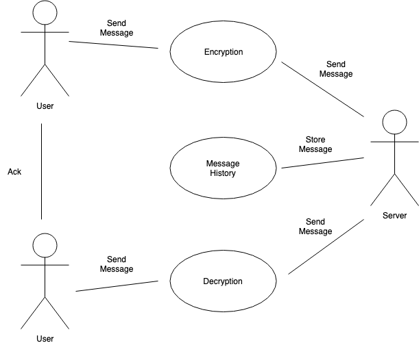

# Signal - Fast, Simple, Secure Messaging
_Project Signal Outline_

## Project Abstract
Signal by Open Whisper Systems is a private messaging app available on Android and iOS devices, as well as on desktop. The open source repository in question is for the Android version of the app, as the majority of the code is in Java. The repo for the iOS version is mostly in Objective-C, while the repo for the desktop version is in JavaScript, with support for Windows, Mac, and Linux. Boasting the tagline "privacy that fits in your pocket", Signal is a fast, simple, and secure messaging service with extra emphasis on secure messaging. As an open source project supported by grants and donations, Signal has already been released in the app stores; however, the project is not yet complete, as there are bugs and issues to address within its various versions.

## Project Relevance
This project is relevant to the course in the aspects of Version Control _(seeing how the code was created and revised over time, thus allowing us to identify the bugs as they appeared over time)_, Debugging _(being able to understand the code that other contributers have provided and being able to revise them)_, and Issue Tracking _(proposing issues that have been noticed through use of the project / debugging, as well as working on resolving issues that have already been noticed)_. Being an open source app, Signal gives us the opportunity to contribute to the design, development, and maintenance aspect of the project. Issues that have been brought up in the repository range from UI bugs to network connectivity and transmission issues. 

## Conceptual Design
A contribution that I would like to take part in is to resolve one of the issues. Issue number 8674, _Time of received message is shown in local time of sender instead of receiver_ was the issue I had in mind. The bug was verified from another user that the issue exists not just on a local level, meaning that other users are having the same issue. The user was sending messages to someone from a different time zone, and the timestamps of the replies he received were the timestamps of the other time zone, not his. More details can be found in the issue itself (link provided in the background section below).

For this project, I would need interested teammates preferably with Android devices, although having iOS devices would also come in handy in order to cover all the bases. In the case that this issue has been resolved in advance, I would still be interested in pursuing another open issue.

## Background
https://github.com/signalapp/Signal-Android

https://github.com/signalapp/Signal-Android/issues/8674

https://signal.org/

## Goals and Milestones

* Configure the Android SDK to develop Signal
* Identify bugs and/or feature requests that are the best candidates for us to work on
* Work in pairs to fix the issues
* Update our shared repo with the changed files

#### Work Plan

We plan to use an Agile approach to develop this project. Most of our development will involve editing existing code and fixing bugs. We will meet frequently in person and keep constant communication online in order to keep the pace of development. This development approach will minimize overhead resulting from documenting the changes in our code.
